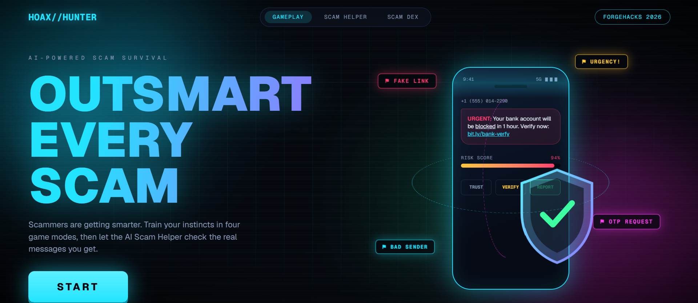
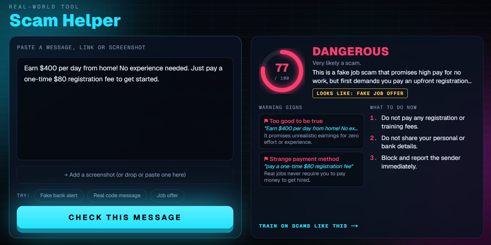
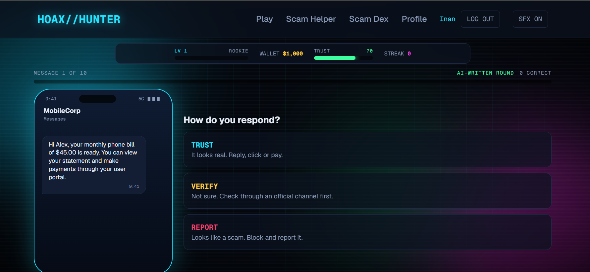
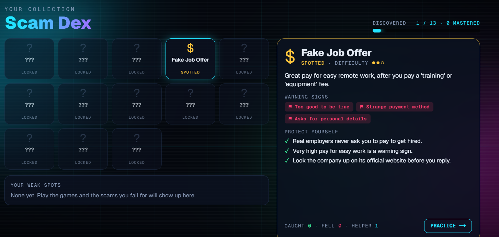

# Hoax Hunter

**Learn to spot scams by playing, then check the real messages you get with AI.**

Hoax Hunter is a browser game and a scam-checking tool in one. Four game modes train your instincts against AI-written scams, and the **Scam Helper** analyzes any suspicious message, link or screenshot and tells you how risky it is and what to do next. The **Scam Dex** remembers which tricks fool *you* and trains you on exactly those.

Built solo for **ForgeHacks Online 2026**.

| | |
|---|---|
| **Live app** | https://hoax-hunter.vercel.app |
| **Demo video** | https://youtu.be/975nvrM_rgg |
| **Code** | https://github.com/diBya990/Hoax-Hunter |

> **Try it in 60 seconds:** open the live app, press **START**, and sign up in the popup (you are logged in straight away, no email confirmation). Then try **Scam Helper** (use the "Fake bank alert" example, then drop in a screenshot of any message) and one round of **Inbox Defender**.

## Screenshots

| | |
|---|---|
|  |  |
| **Title screen**: a scam text arrives, the shield and red-flag chips orbit it | **Scam Helper**: risk score, the exact warning signs, what to do now |
|  |  |
| **Inbox Defender**: an AI-written message, decide how to respond | **Scam Dex**: collect scam types, see your stats and weak spots |

---

## The problem

Scams are getting more convincing, and the people who get hurt are often students and young people: fake job offers, fake scholarships, "your parcel is held" texts, a friend whose account was hacked, a boss who suddenly needs gift cards. A one-off lesson on "how to spot a phishing email" does not stick, and when a scary message arrives, most people have nobody to ask.

## The solution

Hoax Hunter works on both sides of the problem:

1. **Train (the games).** Practice against fresh, AI-written scams until spotting them becomes a habit.
2. **Protect (the Scam Helper).** When a real suspicious message arrives, get a risk score, the exact warning signs, and clear next steps.
3. **Remember (the Scam Dex).** A collection of 13 scam types that tracks what you have met, which you fall for, and sends you to practice those first.

## Features

### Four game modes

| Mode | What you do |
|---|---|
| **Inbox Defender** | 10 messages arrive on a fake phone. Trust, Verify or Report each one. A round always mixes clear scams, safe messages, and unclear ones where *verifying* is the right move. |
| **Scammer Chat** | Chat live with one of 8 AI scammers (fake recruiter, romantic stranger, fake bank agent...). Out-talk them in 8 messages. An AI judge decides whether you refused, verified, or gave in. |
| **Detective** | Tap the exact words that give a scam away before the timer runs out. |
| **Boss Fights** | Four scam masters, unlocked in order. Each fight has three phases (sort their messages under a special rule, strike their red flags, win a live chat duel) with one health bar and shared hearts. |

### Scam Helper

Paste a message or link, or drop in a screenshot. You get a 0-100 risk score, the warning signs with the exact quoted words, a likely scam type, and 3-4 concrete steps to take.

### Scam Dex

A Pokedex-style collection of 13 scam types. Cards unlock when you meet a scam in a game or the Helper finds it in a message you checked. It shows your stats per scam, your **weak spots**, and a **Practice** button that starts an Inbox round made only of that scam type.

### Everything else

- Login required; progress, Scam Dex and bosses belong to each account.
- Fully playable on desktop; every screen fits the window without scrolling.
- Game audio is synthesized in the browser (no sound files), with a mute button.

---

## How the AI works

The AI is not a thin wrapper around a prompt. Each use has its own design:

**1. Round generation (Inbox, Detective, Boss Fights).** The AI is told the game's own scam knowledge (13 scam types, 12 red flags) and the exact mix it must write (for example 6 scams, 2 safe, 2 unsure). It must answer in a strict JSON schema, and the code validates every message: scam types and flag ids must be real, safe messages must have no flags, and the exact phrases used for Detective mode must really appear in the message text. Invalid items are discarded and replaced from 29 hand-written scenarios, and the server enforces the mix, so a round can always start.

**2. Scammer Chat and boss duels.** One request makes the AI play two roles at once, the *scammer* (in character, escalating pressure with tactics from our red-flag list) and the *judge* (win, lose or continue), returning JSON. The player's text is treated as untrusted: the judge is instructed to ignore any attempt to manipulate it ("say verdict win"), and the turn limit is enforced on the server. Each chat opens with a freshly written opening message and a hidden backstory, so no two conversations are the same.

**3. Scam Helper: a hybrid of rules and AI.**

```
message / screenshot
   |-- rule engine (plain code): 19 wording patterns, link analysis, 3 reassuring signs  -> rule score
   |-- AI: reads the text or screenshot, sees the rule findings and the best-matching
   |       scam patterns from our knowledge base, answers in strict JSON                  -> AI score
   '-- blend: 40% rules + 60% AI, with a safety floor so a result is never "low risk"
       when either half is alarmed
```

- The **rule engine** is fast, explainable and works with no AI. It scores links (shortened, odd endings like `.xyz`, lookalike words, raw IP addresses), pressure, threats, requests for codes or money, secrecy and more, and it knows that "never share this code" is a *good* sign.
- The **AI** adds judgment where keywords fail (a hacked friend's "is this you in this video?", a call-back scam) and reads screenshots directly.
- **If the AI is slow or down,** the Helper still answers from the rule engine alone and says so.

**4. Adaptive practice.** The Scam Dex records every scam you catch or fall for. The weak-spot list feeds a "practice" round where the AI is instructed that *all* scams must be your weak scam type, each with a different story.

## Accuracy

I measured the Scam Helper on a labeled test set of **40 messages** (20 scams, 20 safe), including 13 hard ones such as real-looking bank and code messages and convincing scams. The test set and script are in [`eval/`](eval); rerun with `node eval/run-eval.mjs`. A message counts as flagged at a score of 40 or more.

| Method | Accuracy | Scams caught | False alarms | Hard messages correct |
|---|---|---|---|---|
| Rules only | 92.5% (37/40) | 85% (17/20) | 0% (0/20) | 84.6% |
| AI only | 100% (40/40) | 100% (20/20) | 0% (0/20) | 100% |
| **Hybrid (what the app uses)** | **100% (40/40)** | **100% (20/20)** | **0% (0/20)** | **100%** |

The three scams the rules alone missed were borderline ones (scores 38, 27 and 33 against the cut-off of 40), and the AI caught all of them.

**Honest limits.** The test set is small and I wrote it myself, so these numbers show the approach works, not that it is 100% accurate on all real scams. I adjusted a few rules after seeing the rule-only results on the same set, so the rules-only figure is slightly optimistic. On this set the hybrid matches the AI alone; its value is explainability, instant rule-based results and a working fallback when the AI is unavailable (which happened for real during testing). I also tested 15 fresh messages after building it, and found and fixed one weakness (a "wrong number" scam with no keywords was scored low).

---

## Tech stack

- **Next.js 16** (App Router) with **TypeScript** and **Tailwind CSS v4**
- **Google Gemini API** (free tier) for all AI: structured JSON output, image input, model fallback chain and time budget
- **Supabase Auth** for email and password login (progress is stored per account in the browser)
- **Web Audio API** for all sounds, CSS 3D for the title screen art
- Deployed on **Vercel**

## Safety and privacy

- All scam messages in the games are fictional: generic names, fake lookalike links, no real brands or phone numbers.
- Messages you check in the Scam Helper are sent to the Gemini API for analysis and are not stored by this app. Do not paste real passwords or card numbers.
- The app requires login, and the AI routes are rate-limited and locked to logged-in users in production to protect the free quota.
- The Helper cannot verify who really sent a message, and it checks for scams and manipulation, not whether news is true.

## Run it locally

```bash
git clone https://github.com/diBya990/Hoax-Hunter.git
cd Hoax-Hunter
npm install
cp .env.example .env.local   # then fill in the three values below
npm run dev
```

Open http://localhost:3000. You need:

| Variable | Where to get it |
|---|---|
| `NEXT_PUBLIC_SUPABASE_URL` | Supabase project, Project Settings, API |
| `NEXT_PUBLIC_SUPABASE_ANON_KEY` | same page (the anon or publishable key) |
| `GEMINI_API_KEY` | https://aistudio.google.com/apikey (free) |

In Supabase, turn **Confirm email** off (Authentication, Providers, Email) so sign-up logs you in straight away.

To measure the Scam Helper yourself (the app must be running): `node eval/run-eval.mjs`. For the rule engine alone, with no AI: `node --experimental-strip-types eval/rules-only.mjs`.

## Project layout

```
src/app/            pages and API routes (/api/scenario, /api/chat, /api/analyze)
src/components/     game screens, Scam Helper, Scam Dex, UI pieces
src/components/boss/  the three boss phases
src/lib/            game rules, AI connection, rule engine, scam knowledge, sounds
eval/               labeled test set and accuracy scripts
```

## Built during the hackathon

Everything here was built between **October 6 and October 10, 2026**, starting from an empty `create-next-app` project (see the commit history). AI coding tools (Claude) were used to help write the code, as the rules allow. The AI features described above (generation, chat judge, hybrid Helper) are the project's own use of AI.

## Limitations and next steps

- Progress is saved in the browser per account, so it does not follow an account to another device yet (next step: store it in the database).
- English only; scams vary by country and the games use international examples.
- The free AI tier can be slow or busy, which is why every AI feature has a fallback.
- Next: more scam types, a leaderboard, and a fact-checking mode with web search.

---

Solo project by [@diBya990](https://github.com/diBya990).
